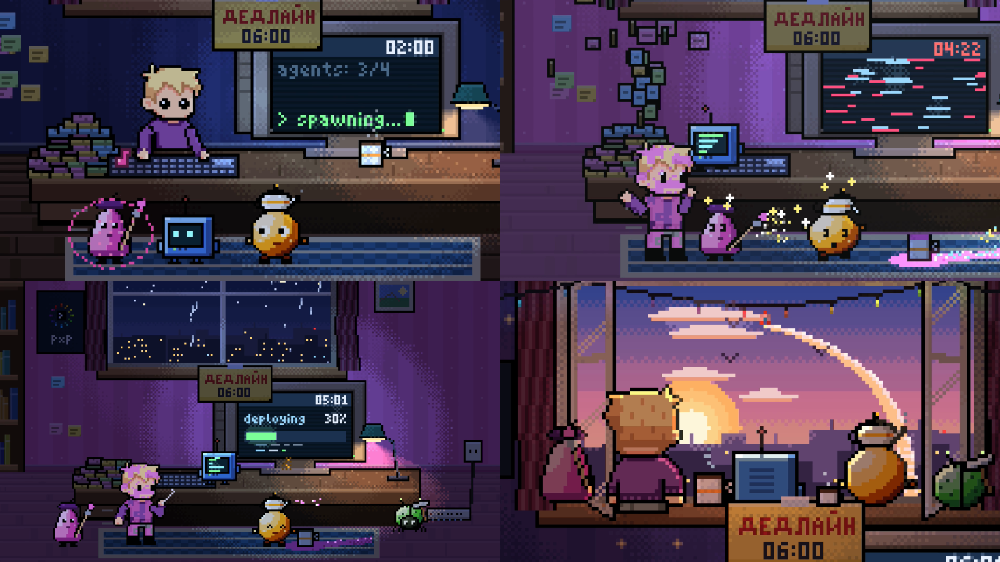

# «Агенты» — пиксельный мультик, полностью посчитанный кодом

[](https://github.com/Qwinty/agents-pixel-film/raw/main/out/film.mp4)

**▶ [Смотреть фильм (MP4, 45 с, 40 МБ)](https://github.com/Qwinty/agents-pixel-film/raw/main/out/film.mp4)**

45 секунд, 1920×1080, 30 fps. Ночь, дедлайн в 06:00. Герой канала
[Pixel by Pixel](https://t.me/p_by_p) запускает четырёх AI-агентов, те устраивают в комнате
хаос цепной реакцией, а в темноте после замыкания герой начинает ими дирижировать.

Каждый кадр и каждый звук считает программа. Здесь нет видеоредактора, генерации картинок
и сэмплов. Из готовых файлов в кадр попадают только спрайт героя 24×45
(`footage/character/`) и логотип с QR (`footage/brand/`). Всё остальное нарисовано кодом
пиксель за пикселем в той же сетке.

## Сборка

```bash
npm run build
```

Нужны Node ≥ 20 и `ffmpeg` в PATH, npm-зависимостей нет. Команда синтезирует звук, считает
1350 кадров параллельно и собирает `out/film.mp4`. На 16 потоках это занимает около 40 секунд.
Остальные команды и HTML-плеер описаны в [docs/BUILD.md](docs/BUILD.md).

## Как это сделано

- **Кадр — чистая функция времени.** Каждая из 16 сцен — это `render(t)`. Состояние комнаты
  (часы, дождь, кофе, краска, рассвет) тоже вычисляется из `t`. Поэтому кадры можно считать
  в любом порядке и параллельно, а результат всегда одинаковый.
- **Холст 320×180 арт-пикселей, масштаб ×6.** Свет, дизеринг Байера и камера с зумом
  работают в одной сетке с героем.
- **Одна музыкальная сетка на картинку и звук.** Склейки, удары и ноты стоят в 128 BPM.
  У каждого бота своя нота, вместе они дают аккорд рассвета.
- **Звук синтезирует свой DSP-код:** осцилляторы, фильтры, реверб и лимитер.
- **HTML-плеер** считает тот же фильм прямо в браузере тем же кодом.

Подробнее:
- [docs/ARCHITECTURE.md](docs/ARCHITECTURE.md) — код и принятые решения;
- [docs/SCENES.md](docs/SCENES.md) — все 16 сцен;
- [docs/RESULTS.md](docs/RESULTS.md) — проверки, что получилось и что нет.

## Сессия Claude Code

Фильм сделан за одну сессию Claude Code по заданию [PROMPT_B_nogen.md](PROMPT_B_nogen.md).
Главный агент написал движок, декорацию, героя, пайплайн и первые кадры. Саундтрек и
четыре группы кадров делали параллельные субагенты.

| | |
|---|---|
| Время | **1 ч 52 мин**: 1 ч 34 мин до первой версии и 14 мин на правки |
| Модели | Claude Opus 5.5 (главный агент), Opus 5 и Opus 5.5 (9 субагентов) |
| API-вызовов | 582 |
| Токенов | **120.2 млн**: 116.2 млн чтение кэша, 3.0 млн запись в кэш, 1.07 млн output |
| Стоимость по ценам API | **≈ $69** |
| Код | ~9.5 тыс. строк JS |

Поэтапное время, токены по каждому субагенту и расчёт стоимости — в
[docs/SESSION.md](docs/SESSION.md).
