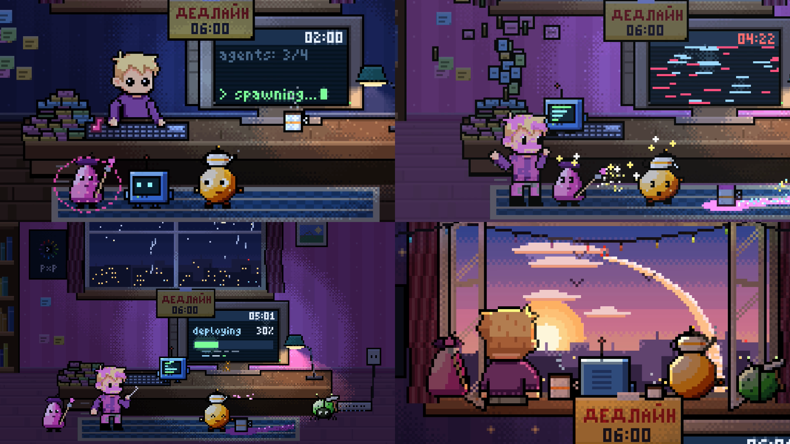

# «Агенты» — пиксельный мультик, полностью посчитанный кодом

[English](README.md)

[](https://qwinty.github.io/agents-pixel-film/#ru)

**▶ [Смотреть фильм](https://qwinty.github.io/agents-pixel-film/#ru)** ·
[MP4, русская версия, 38 МБ](https://github.com/Qwinty/agents-pixel-film/raw/main/out/film.ru.mp4) ·
[MP4, английская с озвучкой](https://github.com/Qwinty/agents-pixel-film/raw/main/out/film.mp4)

45 секунд, 1920×1080, 30 fps. Ночь, дедлайн в 06:00. Герой канала
[Pixel by Pixel](https://t.me/p_by_p) запускает четырёх AI-агентов, те устраивают в комнате
хаос цепной реакцией, а в темноте после замыкания герой начинает ими дирижировать.

Каждый кадр, музыку и каждый звуковой эффект считает программа. Здесь нет видеоредактора,
генерации картинок и сэмплов. Из готовых файлов в кадр попадают только спрайт героя 24×45
(`footage/character/`) и логотип с QR (`footage/brand/`). Всё остальное нарисовано кодом
пиксель за пикселем в той же сетке. Единственное исключение — голос рассказчицы в английской
версии: это синтез речи ElevenLabs.

## Версии

| | Файл | Озвучка | Субтитры |
|---|---|---|---|
| **Английская** (основная) | `out/film.mp4` | английская, голос Lily | пиксельные, вшиты в кадр |
| Русская | `out/film.ru.mp4` | нет: только музыка и звуки | нет |

Кроме субтитров, картинка двух версий отличается только словом на двух стикерах дедлайна
(DEADLINE / ДЕДЛАЙН). Остальные надписи на экране в обеих версиях английские.

## Сборка

```bash
npm run build        # английская → out/film.mp4
npm run build:ru     # русская, без озвучки → out/film.ru.mp4
```

Нужны Node ≥ 20 и `ffmpeg` в PATH, npm-зависимостей нет. Команда синтезирует саундтрек,
подмешивает озвучку, считает 1350 кадров параллельно (вместе с субтитрами) и собирает MP4.
На 16 потоках одна версия собирается меньше чем за минуту. Дубль озвучки лежит в `voice/`,
поэтому для сборки ключ API не нужен. Остальные команды описаны в
[docs/ru/BUILD.md](docs/ru/BUILD.md).

## Как это сделано

- **Кадр — чистая функция времени.** Каждая из 16 сцен — это `render(t)`. Состояние комнаты
  (часы, дождь, кофе, краска, рассвет) тоже вычисляется из `t`. Поэтому кадры можно считать
  в любом порядке и параллельно, а результат всегда одинаковый.
- **Холст 320×180 арт-пикселей, масштаб ×6.** Свет, дизеринг Байера и камера с зумом
  работают в одной сетке с героем.
- **Одна музыкальная сетка на картинку и звук.** Склейки, удары и ноты стоят в 128 BPM.
  У каждого бота своя нота, вместе они дают аккорд рассвета.
- **Звук синтезирует свой DSP-код:** осцилляторы, фильтры, реверб и лимитер.
- **Озвучка стоит в той же сетке.** Живая рассказчица реагирует на хаос 14 короткими
  репликами, у каждой своя подача: нервно, с азартом, со смешком, криком, шёпотом, ахом.
  Это один дубль ElevenLabs v3, время каждого слова даёт принудительное выравнивание (forced
  alignment). Код режет дубль на реплики и ставит каждую точно на её CUE. Если реплика не
  влезает в своё окно, паузы в ней сжимаются или она чуть ускоряется без смены высоты голоса.
  Музыка приседает под голосом. Удар по Enter, четыре ноты при спавне, стук тестера и «догадка»
  в темноте остаются без голоса.
- **Пиксельные субтитры.** В английской версии субтитры набраны своим пиксельным шрифтом 5×7
  в сетке героя. Каждое слово появляется в момент, когда его произносят. Имена ботов — цветом
  бота, шёпот — приглушённым, крик дрожит, а финальная подпись — в цветах логотипа.

Подробнее:
- [docs/ru/ARCHITECTURE.md](docs/ru/ARCHITECTURE.md) — код и принятые решения;
- [docs/ru/SCENES.md](docs/ru/SCENES.md) — все 16 сцен и текст озвучки;
- [docs/ru/RESULTS.md](docs/ru/RESULTS.md) — проверки, что получилось и что нет.

## Озвучка

- Голос: ElevenLabs `eleven_v3`, готовый голос Lily. Подачу задают аудиотеги v3
  (`[nervous]`, `[laughs]`, `[whispers]`…). Русская версия без озвучки.
- Текст и тайминг реплик — в [src/narration.js](src/narration.js). После правки текста новый
  дубль записывается командой `npm run voice`. Ключ берётся из `ELEVENLABS_API_KEY` в окружении
  или из `.env`.
- Озвучка сгенерирована в [ElevenLabs](https://elevenlabs.io).

## Сессия Claude Code

Фильм сделан за одну сессию Claude Code по заданию [PROMPT_B_nogen.md](PROMPT_B_nogen.md).
Главный агент написал движок, декорацию, героя, пайплайн и первые кадры. Саундтрек и
четыре группы кадров делали параллельные субагенты.

| | |
|---|---|
| Время | **1 ч 52 мин**: 1 ч 34 мин до первой версии и 14 мин на правки |
| Модели | Claude Opus 5.5 (главный агент), Opus 5 и Opus 5.5 (9 субагентов) |
| API-вызовов | 582 |
| Токенов | **120.2 млн**: 116.2 млн чтение кэша, 3.0 млн запись в кэш, 1.07 млн output |
| Стоимость по ценам API | **≈ $69** |
| Код | ~9.5 тыс. строк JS |

Поэтапное время, токены по каждому субагенту и расчёт стоимости — в
[docs/ru/SESSION.md](docs/ru/SESSION.md). Английская версия, озвучка и субтитры добавлены
позже, отдельной сессией; в эти цифры они не входят.
